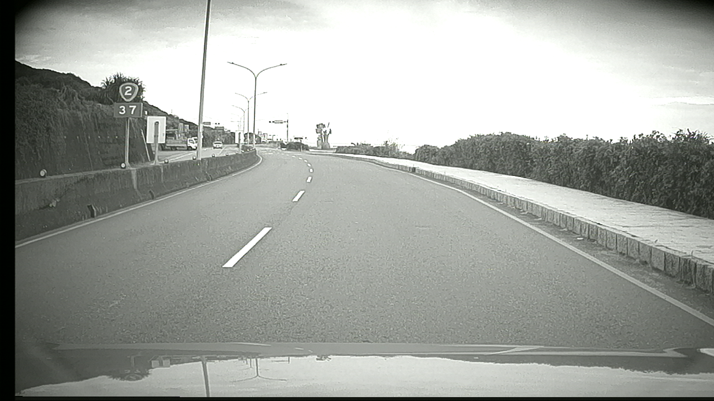
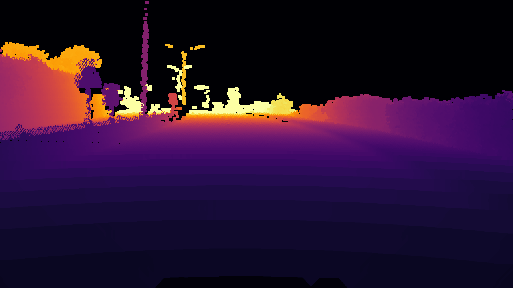

# LiDAR Depth Projection Pipeline

這個專案提供一個完整流程，將 LiDAR 點雲投影到相機座標系，生成對應的 dense depth map，並輸出彩色視覺化結果。

## 功能特色
- 遞迴搜尋資料夾內所有影像並自動配對對應的點雲檔案 (`.pcd` 或 `.npy`)  
- 支援 Open3D 載入點雲  
- 使用相機內參 (`K`) 與 LiDAR-to-Camera 外參 (`T_lidar_to_cam`) 做投影  
- 最近點優先的 depth map 建構邏輯  
- 補洞演算法 (`fast_fill_depth`) 加速與局部增強（特別針對影像下半部）  
- 輸出：
  - Dense depth map (`.npy`)  
  - 彩色深度圖 (`.png`, 使用 `cv2.COLORMAP_INFERNO`)  

## 目錄結構
```
project_root/
│
├── elan_dataset/                  # 輸入資料
│   ├── scene1/
│   │   ├── image/                 # 影像資料
│   │   │   ├── 00001.jpg
│   │   │   ├── 00002.jpg
│   │   ...
│   │   ├── VLS128_pcdnpy/         # LiDAR 點雲資料
│   │   │   ├── 00001.pcd 或 00001.npy
│   │   │   ├── 00002.pcd 或 00002.npy
│   │   ...
│   └── scene2/ ...
│
├── output/                        # 輸出結果
│   ├── scene1/
│   │   ├── depth_output/
│   │   │   ├── 00001.npy
│   │   │   ├── 00001.png
│   │   ...
│   └── scene2/ ...
│
└── lidar_depth_project_v2.py
```

## 安裝需求
Python 3.8+  
```bash
pip install numpy opencv-python opencv-contrib-python open3d scipy
```

## 使用方式
```bash
python lidar_depth_project_v2.py
```

程式會：
1. 遞迴搜尋 `elan_dataset/` 下的所有場景。  
2. 對每張影像，尋找同名的 `.pcd` 或 `.npy` 點雲。  
3. 生成 dense depth map 並輸出至 `output/` 目錄。  

## 輸出結果
- `.npy`：儲存 dense depth map (float32, 單位：meter)  
- `.png`：彩色視覺化的深度圖，方便檢視  

## 範例結果
原始影像與對應輸出的彩色深度圖示意：

| 原始影像 | 彩色深度圖 |
|----------|------------|
|  |  |

## 參數設定
- 最大深度 `max_depth = 80.0`  
- 相機內參矩陣 `K`  
- LiDAR-to-Camera 外參矩陣 `T_lidar_to_cam`  
- `fast_fill_depth(iterations)` 可調整補洞次數  

## 平行化處理
- 使用 `ThreadPoolExecutor`，最多支援 8 workers 並行處理  
